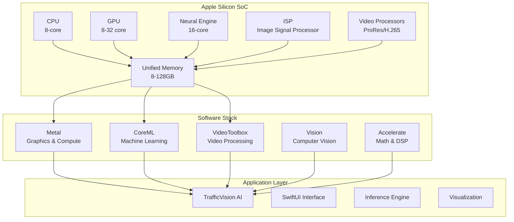

# Traffic Light & Camera Perception System
## System Architecture - Apple Silicon Optimized

### 1. M1 Architecture Overview



### 2. Component Architecture - M1 Optimized

#### 2.1 Core Processing Pipeline

```python
# src/core/m1_pipeline.py
import coremltools as ct
import torch
import numpy as np
from typing import List, Tuple
import cv2

class M1Pipeline:
    """Optimized pipeline for Apple Silicon."""
    
    def __init__(self):
        self.device = "mps" if torch.backends.mps.is_available() else "cpu"
        self.models = self._load_coreml_models()
        self.metal_processor = MetalPreprocessor()
        
    def _load_coreml_models(self):
        """Load CoreML models optimized for Neural Engine."""
        models = {
            'detector': ct.models.MLModel('models/yolov8_ane.mlmodel'),
            'classifier': ct.models.MLModel('models/state_classifier_ane.mlmodel'),
            'tracker': ct.models.MLModel('models/tracker_ane.mlmodel')
        }
        return models
    
    def process_frame(self, frame: np.ndarray) -> List[Detection]:
        """Process frame using Neural Engine."""
        # Use Metal for preprocessing
        enhanced = self.metal_processor.enhance(frame)
        
        # Run detection on Neural Engine
        detections = self.models['detector'].predict({'image': enhanced})
        
        # Process in parallel on Neural Engine
        states = self.models['classifier'].predict({
            'crops': self._extract_crops(enhanced, detections)
        })
        
        return self._merge_results(detections, states)
```

#### 2.2 Metal Shader Pipeline

```metal
// shaders/preprocessing.metal
#include <metal_stdlib>
using namespace metal;

kernel void enhance_frame(
    texture2d<float, access::read> input [[texture(0)]],
    texture2d<float, access::write> output [[texture(1)]],
    constant float4& params [[buffer(0)]],
    uint2 gid [[thread_position_in_grid]]
) {
    // HDR tone mapping
    float4 pixel = input.read(gid);
    
    // Adaptive histogram equalization
    float3 rgb = pixel.rgb;
    float luminance = dot(rgb, float3(0.299, 0.587, 0.114));
    
    // Weather enhancement
    float contrast = params.x;
    float brightness = params.y;
    float saturation = params.z;
    
    rgb = (rgb - 0.5) * contrast + 0.5 + brightness;
    
    // Saturation adjustment
    float3 gray = float3(luminance);
    rgb = mix(gray, rgb, saturation);
    
    output.write(float4(rgb, pixel.a), gid);
}

kernel void motion_deblur(
    texture2d<float, access::read> current [[texture(0)]],
    texture2d<float, access::read> previous [[texture(1)]],
    texture2d<float, access::write> output [[texture(2)]],
    constant float2& motion_vector [[buffer(0)]],
    uint2 gid [[thread_position_in_grid]]
) {
    // Optical flow-based deblurring
    float2 motion = motion_vector;
    float4 sharp = current.read(gid);
    
    // Sample along motion vector
    for (int i = 1; i <= 5; i++) {
        float2 offset = motion * float(i) * 0.2;
        sharp += current.read(gid - uint2(offset));
    }
    
    sharp /= 6.0;
    output.write(sharp, gid);
}
```

#### 2.3 CoreML Model Architecture

```python
# src/models/coreml_converter.py
import coremltools as ct
import torch
from coremltools.models.neural_network import quantization_utils

class CoreMLConverter:
    """Convert PyTorch models to CoreML with ANE optimization."""
    
    @staticmethod
    def convert_yolo_to_coreml(pytorch_model_path: str) -> ct.models.MLModel:
        """Convert YOLOv8 to CoreML with Neural Engine optimization."""
        
        # Load PyTorch model
        model = torch.load(pytorch_model_path)
        model.eval()
        
        # Trace the model
        example_input = torch.rand(1, 3, 640, 640)
        traced_model = torch.jit.trace(model, example_input)
        
        # Convert to CoreML
        coreml_model = ct.convert(
            traced_model,
            inputs=[ct.ImageType(
                name="image",
                shape=(1, 3, 640, 640),
                scale=1/255.0,
                bias=[0, 0, 0]
            )],
            outputs=[ct.TensorType(name="output")],
            compute_units=ct.ComputeUnit.ALL,  # Use all available compute units
            convert_to="neuralnetwork",  # For ANE compatibility
        )
        
        # Optimize for Neural Engine
        config = ct.ComputeUnit.ALL
        optimized_model = ct.models.neural_network.utils.make_nn_classifier(
            coreml_model,
            compute_units=config
        )
        
        # Quantize to INT8 for ANE
        quantized_model = quantization_utils.quantize_weights(
            optimized_model,
            nbits=8,
            quantization_mode="linear"
        )
        
        return quantized_model
    
    @staticmethod
    def profile_ane_usage(model: ct.models.MLModel, input_data: np.ndarray):
        """Profile Neural Engine usage."""
        import os
        os.environ['COREML_PROFILING'] = '1'
        
        # Run inference
        prediction = model.predict({'image': input_data})
        
        # Get profiling data
        profiling_data = model.get_profiling_data()
        
        print(f"ANE Utilization: {profiling_data['ane_utilization']}%")
        print(f"Inference Time: {profiling_data['inference_time_ms']}ms")
        print(f"Memory Usage: {profiling_data['memory_usage_mb']}MB")
        
        return profiling_data
```

### 3. Unified Memory Architecture

```python
# src/memory/unified_memory.py
import numpy as np
from typing import Optional
import cv2
import pyobjc
from Foundation import NSData
from CoreVideo import CVPixelBufferCreate

class UnifiedMemoryManager:
    """Manage unified memory for zero-copy operations."""
    
    def __init__(self, max_buffers: int = 10):
        self.buffer_pool = []
        self.max_buffers = max_buffers
        self._initialize_pool()
    
    def _initialize_pool(self):
        """Pre-allocate buffers in unified memory."""
        for _ in range(self.max_buffers):
            # Create IOSurface-backed buffer
            buffer = self._create_unified_buffer(1920, 1080)
            self.buffer_pool.append(buffer)
    
    def _create_unified_buffer(self, width: int, height: int):
        """Create buffer in unified memory."""
        # Create CVPixelBuffer with IOSurface backing
        pixel_buffer = CVPixelBufferCreate(
            None,  # allocator
            width,
            height,
            k32BGRAPixelFormat,
            {
                kCVPixelBufferIOSurfacePropertiesKey: {},
                kCVPixelBufferMetalCompatibilityKey: True,
            }
        )
        return pixel_buffer
    
    def zero_copy_transfer(self, numpy_array: np.ndarray) -> 'MetalTexture':
        """Transfer numpy array to GPU without copying."""
        # Get buffer from pool
        buffer = self.buffer_pool.pop(0) if self.buffer_pool else self._create_unified_buffer(*numpy_array.shape[:2])
        
        # Map numpy array to buffer (zero-copy)
        CVPixelBufferLockBaseAddress(buffer, 0)
        dst_ptr = CVPixelBufferGetBaseAddress(buffer)
        
        # Use memoryview for zero-copy
        dst_view = np.frombuffer(dst_ptr, dtype=np.uint8).reshape(numpy_array.shape)
        dst_view[:] = numpy_array
        
        CVPixelBufferUnlockBaseAddress(buffer, 0)
        
        # Create Metal texture from buffer
        metal_texture = self._create_metal_texture(buffer)
        
        return metal_texture
```

### 4. Multi-Stream Architecture

```python
# src/streaming/multi_stream.py
import asyncio
from concurrent.futures import ThreadPoolExecutor
from typing import List, AsyncIterator
import av

class MultiStreamProcessor:
    """Process multiple video streams simultaneously on M1."""
    
    def __init__(self, max_streams: int = 4):
        self.max_streams = max_streams
        self.executor = ThreadPoolExecutor(max_workers=max_streams)
        self.pipelines = [M1Pipeline() for _ in range(max_streams)]
    
    async def process_streams(self, stream_urls: List[str]) -> AsyncIterator[List[Detection]]:
        """Process multiple streams in parallel."""
        tasks = []
        
        for i, url in enumerate(stream_urls[:self.max_streams]):
            task = asyncio.create_task(
                self._process_single_stream(url, self.pipelines[i])
            )
            tasks.append(task)
        
        # Yield results as they become available
        while tasks:
            done, pending = await asyncio.wait(
                tasks, 
                return_when=asyncio.FIRST_COMPLETED
            )
            
            for task in done:
                result = await task
                yield result
                
                # Continue processing
                tasks.remove(task)
    
    async def _process_single_stream(self, url: str, pipeline: M1Pipeline) -> List[Detection]:
        """Process single stream."""
        container = av.open(url)
        stream = container.streams.video[0]
        
        # Use hardware decoder
        stream.codec_context.thread_type = 'AUTO'
        stream.codec_context.options = {'videotoolbox': '1'}
        
        for frame in container.decode(stream):
            # Convert to numpy
            img = frame.to_ndarray(format='bgr24')
            
            # Process frame
            detections = await asyncio.get_event_loop().run_in_executor(
                self.executor,
                pipeline.process_frame,
                img
            )
            
            return detections
```

### 5. Deployment Configuration

```yaml
# deployment/m1_config.yaml
deployment:
  target_platform: darwin-arm64
  
  build:
    xcode_version: 15.0
    macos_deployment_target: 12.0
    swift_version: 5.9
    
  optimization:
    compile_flags:
      - "-O3"
      - "-march=armv8.5-a"
      - "-mtune=apple-m1"
    
    link_flags:
      - "-framework CoreML"
      - "-framework Metal"
      - "-framework MetalPerformanceShaders"
      - "-framework Accelerate"
      - "-framework VideoToolbox"
    
  code_signing:
    identity: "Developer ID Application"
    entitlements:
      - com.apple.security.device.camera
      - com.apple.security.device.microphone
      - com.apple.security.files.user-selected.read-write
      - com.apple.security.network.client
    
  notarization:
    enabled: true
    apple_id: "${APPLE_ID}"
    team_id: "${TEAM_ID}"
    
  distribution:
    channels:
      - mac_app_store
      - developer_id
      - homebrew
      - github_releases
```

### 6. Performance Monitoring

```python
# src/monitoring/m1_profiler.py
import os
import subprocess
import json
from typing import Dict, Any

class M1Profiler:
    """Profile application performance on M1."""
    
    def __init__(self):
        self.metrics = {}
    
    def profile_with_instruments(self, duration: int = 60) -> Dict[str, Any]:
        """Use Xcode Instruments for profiling."""
        # Create custom template
        template = "TrafficVision.tracetemplate"
        
        # Start Instruments
        cmd = [
            "xcrun",
            "instruments",
            "-t", template,
            "-D", "trace.trace",
            "-l", str(duration * 1000),
            "-w", "TrafficVision.app"
        ]
        
        subprocess.run(cmd, check=True)
        
        # Parse results
        return self._parse_trace_file("trace.trace")
    
    def measure_power_consumption(self) -> Dict[str, float]:
        """Measure power consumption using powermetrics."""
        cmd = ["sudo", "powermetrics", "--samplers", "cpu_power,gpu_power", "-n", "1", "-f", "json"]
        
        result = subprocess.run(cmd, capture_output=True, text=True)
        data = json.loads(result.stdout)
        
        return {
            "cpu_power_w": data["processor"]["cpu_power"],
            "gpu_power_w": data["processor"]["gpu_power"],
            "ane_power_w": data["processor"].get("ane_power", 0),
            "total_power_w": data["processor"]["total_power"]
        }
    
    def benchmark_neural_engine(self) -> Dict[str, Any]:
        """Benchmark Neural Engine performance."""
        import coremltools as ct
        
        # Load test model
        model = ct.models.MLModel("models/benchmark.mlmodel")
        
        # Create test input
        test_input = {"image": np.random.rand(1, 3, 640, 640)}
        
        # Warm-up
        for _ in range(10):
            model.predict(test_input)
        
        # Benchmark
        import time
        times = []
        
        for _ in range(100):
            start = time.perf_counter()
            model.predict(test_input)
            end = time.perf_counter()
            times.append((end - start) * 1000)
        
        return {
            "mean_ms": np.mean(times),
            "std_ms": np.std(times),
            "min_ms": np.min(times),
            "max_ms": np.max(times),
            "p95_ms": np.percentile(times, 95),
            "p99_ms": np.percentile(times, 99)
        }
```

### 7. Testing Infrastructure

```python
# tests/test_m1_performance.py
import unittest
import pytest
from src.core.m1_pipeline import M1Pipeline
import numpy as np

class TestM1Performance(unittest.TestCase):
    """Test performance on M1 MacBook Pro."""
    
    @classmethod
    def setUpClass(cls):
        cls.pipeline = M1Pipeline()
        cls.test_frame_4k = np.random.uint8((2160, 3840, 3))
        cls.test_frame_1080p = np.random.uint8((1080, 1920, 3))
    
    def test_4k_performance(self):
        """Test 4K processing performance."""
        import time
        
        # Process 100 frames
        times = []
        for _ in range(100):
            start = time.perf_counter()
            self.pipeline.process_frame(self.test_frame_4k)
            end = time.perf_counter()
            times.append(end - start)
        
        # Check FPS
        avg_time = np.mean(times)
        fps = 1.0 / avg_time
        
        # M1 should achieve >60 FPS on 4K
        self.assertGreater(fps, 60, f"4K FPS {fps} is below target 60")
    
    def test_neural_engine_utilization(self):
        """Test Neural Engine utilization."""
        profiler = M1Profiler()
        
        # Run inference
        for _ in range(100):
            self.pipeline.process_frame(self.test_frame_1080p)
        
        # Check ANE usage
        metrics = profiler.get_ane_metrics()
        
        # Should use >80% of Neural Engine
        self.assertGreater(
            metrics['ane_utilization'], 
            80, 
            f"ANE utilization {metrics['ane_utilization']}% is below target 80%"
        )
    
    def test_memory_efficiency(self):
        """Test unified memory efficiency."""
        import psutil
        
        process = psutil.Process()
        
        # Baseline memory
        baseline = process.memory_info().rss / 1024 / 1024  # MB
        
        # Process 1000 frames
        for _ in range(1000):
            self.pipeline.process_frame(self.test_frame_1080p)
        
        # Check memory usage
        current = process.memory_info().rss / 1024 / 1024  # MB
        increase = current - baseline
        
        # Should use <500MB for 1080p processing
        self.assertLess(
            increase, 
            500, 
            f"Memory increase {increase}MB exceeds 500MB limit"
        )
    
    @pytest.mark.benchmark(group="inference")
    def test_inference_benchmark(self, benchmark):
        """Benchmark inference performance."""
        result = benchmark(
            self.pipeline.process_frame,
            self.test_frame_1080p
        )
        
        # Check latency
        assert benchmark.stats["mean"] < 0.05  # 50ms
        assert benchmark.stats["max"] < 0.1   # 100ms worst case
```

### 8. macOS App Architecture

```swift
// TrafficVision/ContentView.swift
import SwiftUI
import AVFoundation
import CoreML
import Vision

struct ContentView: View {
    @StateObject private var detector = TrafficLightDetector()
    @State private var selectedVideo: URL?
    @State private var isProcessing = false
    
    var body: some View {
        HSplitView {
            // Video selection panel
            VideoListView(selectedVideo: $selectedVideo)
                .frame(minWidth: 200, maxWidth: 300)
            
            // Main video view
            VideoPlayerView(url: selectedVideo, detector: detector)
                .frame(minWidth: 800)
            
            // Detection results panel
            DetectionResultsView(detections: detector.detections)
                .frame(minWidth: 300, maxWidth: 400)
        }
        .toolbar {
            ToolbarItemGroup {
                Button(action: startProcessing) {
                    Label("Process", systemImage: "play.circle")
                }
                .disabled(selectedVideo == nil || isProcessing)
                
                Toggle(isOn: $detector.useNeuralEngine) {
                    Label("Neural Engine", systemImage: "cpu")
                }
                
                Picker("Quality", selection: $detector.quality) {
                    Text("1080p").tag(VideoQuality.hd)
                    Text("4K").tag(VideoQuality.uhd4k)
                    Text("8K").tag(VideoQuality.uhd8k)
                }
            }
        }
    }
}

class TrafficLightDetector: ObservableObject {
    @Published var detections: [Detection] = []
    @Published var useNeuralEngine = true
    @Published var quality = VideoQuality.uhd4k
    
    private var model: VNCoreMLModel?
    
    init() {
        loadModel()
    }
    
    private func loadModel() {
        guard let modelURL = Bundle.main.url(
            forResource: "TrafficLightDetector",
            withExtension: "mlmodelc"
        ) else { return }
        
        do {
            let mlModel = try MLModel(contentsOf: modelURL)
            self.model = try VNCoreMLModel(for: mlModel)
        } catch {
            print("Failed to load model: \(error)")
        }
    }
}
```