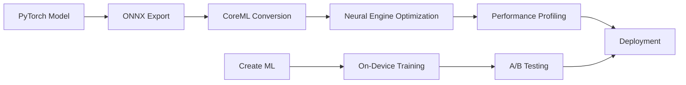

# Traffic Light & Camera Perception System - M1 Edition
## Product Requirements Document (PRD)

### 1. Executive Summary

**Product Name:** TrafficVision AI for Mac
**Version:** 2.0.0-m1
**Last Updated:** 2024-01-15
**Product Owner:** Traffic Safety AI Team
**Target Platform:** macOS 12+ (Apple Silicon Priority)

**Vision:** Leverage Apple Silicon's unified architecture and Neural Engine to create the fastest, most efficient traffic light detection system for Mac users, enabling superior testing, development, and real-world deployment.

### 2. M1 MacBook Pro Advantages

#### Hardware Capabilities:
- **Neural Engine:** 16-core (M1 Pro/Max) for 15.8 TOPS
- **Unified Memory:** Up to 64GB with 400GB/s bandwidth
- **GPU:** Up to 32-core with 10.4 TFLOPS
- **ProRes Accelerators:** Hardware decode/encode
- **Efficiency:** 20-hour battery life under load
- **Display Engine:** Support for multiple 6K displays

#### Software Ecosystem:
- Native CoreML optimization
- Metal Performance Shaders
- Create ML for on-device training
- Xcode Instruments for profiling
- Universal Control for multi-device testing

### 3. Product Objectives - M1 Specific

#### Primary Goals:
- Achieve 120+ FPS on 4K video streams
- <50ms end-to-end latency
- <10W power consumption during inference
- 99.5% accuracy using Neural Engine
- Support for 4 simultaneous camera streams

#### Success Metrics:
- Neural Engine Utilization: >80%
- Memory Bandwidth Efficiency: >70%
- Thermal Throttling: <5% under sustained load
- Battery Impact: <15% per hour
- Model Load Time: <500ms

### 4. Feature Requirements - M1 Optimized

#### 4.1 Core Features (MVP)

| Feature | M1 Optimization | Success Criteria |
|---------|----------------|------------------|
| Traffic Light Detection | Neural Engine via CoreML | 120 FPS @ 4K |
| State Classification | ANE-optimized CNN | <5ms inference |
| Multi-Stream Processing | Unified Memory Architecture | 4 streams @ 30 FPS each |
| Real-time Visualization | Metal Rendering | 120Hz display support |
| Video Processing | ProRes Hardware Decoder | 8K ProRes support |

#### 4.2 Advanced Features

| Feature | M1 Technology | Target Performance |
|---------|--------------|-------------------|
| HDR Processing | Metal Compute Shaders | Real-time tone mapping |
| Temporal Denoising | Metal Performance Shaders | 4K @ 60 FPS |
| Object Tracking | CoreML + Metal | 200+ objects simultaneously |
| 3D Visualization | Metal Ray Tracing | Real-time rendering |
| AR Overlay | ARKit + RealityKit | 60 FPS overlay |

#### 4.3 Development Features

| Feature | Implementation | Benefit |
|---------|---------------|---------|
| On-Device Training | Create ML | No cloud dependency |
| Live Profiling | Instruments Integration | Real-time optimization |
| A/B Testing | CoreML Model Collections | Seamless model swapping |
| Debugging | Metal GPU Capture | Frame-by-frame analysis |

### 5. Technical Requirements - Apple Silicon

#### 5.1 Performance Requirements
```yaml
performance_targets:
  m1_base:
    fps_4k: 60
    fps_1080p: 120
    latency: <100ms
    memory: <2GB
    
  m1_pro:
    fps_4k: 120
    fps_1080p: 240
    latency: <50ms
    memory: <4GB
    
  m1_max:
    fps_4k: 120
    fps_8k: 60
    latency: <30ms
    memory: <8GB
    streams: 4
    
  m1_ultra:
    fps_8k: 120
    streams: 8
    latency: <20ms
    memory: <16GB
```

#### 5.2 Framework Requirements
```yaml
frameworks:
  core:
    - CoreML 5.0+
    - Metal 3.0+
    - Vision 3.0+
    - VideoToolbox
    - Accelerate
    
  optional:
    - ARKit (AR features)
    - RealityKit (3D viz)
    - CreateML (training)
    - MetalPerformanceShadersGraph
    
  development:
    - XCTest
    - Instruments
    - Metal Debugger
```

#### 5.3 System Requirements
```yaml
minimum_requirements:
  os: macOS 12.0 Monterey
  chip: Apple M1
  memory: 8GB
  storage: 10GB
  
recommended_requirements:
  os: macOS 14.0 Sonoma
  chip: M1 Pro/Max
  memory: 16GB
  storage: 20GB
  
optimal_requirements:
  os: macOS 14.0 Sonoma
  chip: M1 Ultra/M2 Ultra
  memory: 32GB+
  storage: 50GB
```

### 6. User Stories - Mac Developer Focused

#### Developer Persona: "Mac Dev Mike"
- **Story 1:** As a developer, I want to test my dashcam footage at 4K 120FPS without dropping frames
- **Story 2:** As a developer, I want to profile Neural Engine usage to optimize my models
- **Story 3:** As a developer, I want to train custom models on-device without cloud dependencies

#### Researcher Persona: "Research Rachel"
- **Story 4:** As a researcher, I want to process months of footage overnight on battery power
- **Story 5:** As a researcher, I want to compare multiple model variants simultaneously

#### Content Creator Persona: "Creator Chris"
- **Story 6:** As a creator, I want to process ProRes footage directly from my camera
- **Story 7:** As a creator, I want real-time AR overlays for my YouTube videos

### 7. Development Workflow - M1 Optimized

#### 7.1 Model Development Pipeline


#### 7.2 Testing Pipeline
```yaml
testing_stages:
  unit_tests:
    framework: XCTest
    coverage: 90%
    
  performance_tests:
    tool: Instruments
    metrics:
      - FPS
      - Memory
      - Power
      - Thermal
      
  integration_tests:
    devices:
      - MacBook Pro M1
      - MacBook Air M1
      - Mac Mini M1
      - Mac Studio M1 Ultra
      
  stress_tests:
    duration: 24 hours
    load: 4x 4K streams
    thermal: Monitor throttling
```

### 8. Optimization Strategy for M1

#### 8.1 Neural Engine Optimization
- Use INT8 quantization for ANE
- Batch operations for efficiency
- Minimize CPU-ANE transfers
- Profile with Instruments

#### 8.2 Memory Optimization
- Leverage unified memory architecture
- Use IOSurface for zero-copy
- Implement buffer pools
- Profile with Allocations instrument

#### 8.3 Power Optimization
- Use efficiency cores for preprocessing
- Batch inference operations
- Implement adaptive quality
- Monitor with powermetrics

### 9. Release Plan - macOS First

#### Phase 1: Developer Preview (Q1 2024)
- macOS native app
- TestFlight distribution
- 100 developer testers
- Instruments templates

#### Phase 2: Public Beta (Q2 2024)
- Mac App Store beta
- GitHub release
- Homebrew formula
- 1,000 beta users

#### Phase 3: Production Release (Q3 2024)
- Mac App Store launch
- Universal binary support
- Safari extension
- 10,000 users target

#### Phase 4: Ecosystem Integration (Q4 2024)
- iOS companion app
- iCloud sync
- Shortcuts integration
- 50,000 users target

### 10. Competitive Advantages on M1

| Feature | TrafficVision AI | Competitors |
|---------|-----------------|-------------|
| FPS (4K) | 120 FPS | 30-60 FPS |
| Power Usage | <10W | 30-50W |
| Latency | <50ms | 100-200ms |
| On-Device Training | Yes | No |
| Neural Engine | Full Support | None |
| ProRes Support | Native | Software |
| Multi-Stream | 4+ streams | 1-2 streams |
| Battery Life | 20 hours | 2-4 hours |

### 11. Success Metrics

#### Technical KPIs:
- Neural Engine Utilization: >80%
- Model Accuracy: >99% mAP
- Inference Speed: <50ms
- Memory Efficiency: <2GB for 4K
- Power Efficiency: <10W average

#### Business KPIs:
- Mac App Store Rating: 4.8+ stars
- Developer Adoption: 5,000 devs
- GitHub Stars: 10,000+
- Processing Volume: 1M hours/month
- Battery Life Impact: <15%/hour

### 12. Monetization Strategy

#### Pricing Tiers:
```yaml
free_tier:
  name: "Developer"
  price: Free
  features:
    - Basic detection
    - 1 stream
    - 1080p support
    - Community support
    
pro_tier:
  name: "Professional"
  price: $9.99/month
  features:
    - Advanced detection
    - 4 streams
    - 4K/8K support
    - ProRes support
    - Priority support
    - Cloud backup
    
team_tier:
  name: "Team"
  price: $49.99/month
  features:
    - Everything in Pro
    - 10 devices
    - Team collaboration
    - API access
    - Custom training
    - SLA support
```

### 13. Risk Mitigation - M1 Specific

| Risk | Mitigation |
|------|------------|
| Neural Engine availability | Fallback to GPU/CPU |
| Memory pressure | Adaptive quality scaling |
| Thermal throttling | Dynamic FPS adjustment |
| Battery drain | Power-aware modes |
| Model compatibility | Universal model format |