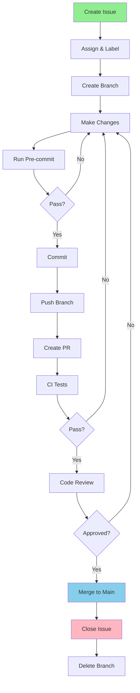

# Pre-commit Configuration and Enforcement

## 1. Complete .pre-commit-config.yaml

```yaml
# .pre-commit-config.yaml
default_language_version:
  python: python3.11
  node: 18.17.0

default_stages: [commit]

repos:
  # ==================== SECURITY ====================
  - repo: https://github.com/Yelp/detect-secrets
    rev: v1.4.0
    hooks:
      - id: detect-secrets
        args: ['--baseline', '.secrets.baseline']
        exclude: package-lock\.json$|yarn\.lock$|\.yarn/|pnpm-lock\.yaml$

  - repo: https://github.com/PyCQA/bandit
    rev: 1.7.5
    hooks:
      - id: bandit
        args: ['-ll', '--skip', 'B101,B601']
        files: \.py$
        exclude: tests/

  - repo: https://github.com/trufflesecurity/trufflehog
    rev: v3.63.2
    hooks:
      - id: trufflehog
        entry: trufflehog filesystem --no-update
        pass_filenames: false

  # ==================== PYTHON ====================
  - repo: https://github.com/astral-sh/ruff-pre-commit
    rev: v0.1.11
    hooks:
      - id: ruff
        args: [--fix, --exit-non-zero-on-fix]
      - id: ruff-format

  - repo: https://github.com/pre-commit/mirrors-mypy
    rev: v1.8.0
    hooks:
      - id: mypy
        additional_dependencies: 
          - types-requests
          - types-PyYAML
          - types-python-dateutil
          - numpy
          - torch
        args: [--strict, --ignore-missing-imports, --python-version=3.11]

  - repo: https://github.com/asottile/pyupgrade
    rev: v3.15.0
    hooks:
      - id: pyupgrade
        args: [--py311-plus]

  # ==================== COMMIT MESSAGE ====================
  - repo: https://github.com/commitizen-tools/commitizen
    rev: v3.13.0
    hooks:
      - id: commitizen
        stages: [commit-msg]

  # ==================== GENERAL ====================
  - repo: https://github.com/pre-commit/pre-commit-hooks
    rev: v4.5.0
    hooks:
      - id: check-added-large-files
        args: ['--maxkb=1000']
        exclude: \.(mlmodel|onnx|pt|pth|h5|pb)$
      - id: check-ast
      - id: check-builtin-literals
      - id: check-case-conflict
      - id: check-docstring-first
      - id: check-executables-have-shebangs
      - id: check-json
      - id: check-merge-conflict
      - id: check-shebang-scripts-are-executable
      - id: check-toml
      - id: check-vcs-permalinks
      - id: check-xml
      - id: check-yaml
        args: ['--unsafe']
      - id: debug-statements
      - id: destroyed-symlinks
      - id: detect-private-key
      - id: end-of-file-fixer
      - id: fix-byte-order-marker
      - id: fix-encoding-pragma
        args: ['--remove']
      - id: mixed-line-ending
        args: ['--fix=lf']
      - id: name-tests-test
        args: ['--pytest-test-first']
      - id: no-commit-to-branch
        args: ['--branch', 'main', '--branch', 'master']
      - id: pretty-format-json
        args: ['--autofix', '--indent=2']
      - id: requirements-txt-fixer
      - id: trailing-whitespace

  # ==================== DOCUMENTATION ====================
  - repo: https://github.com/igorshubovych/markdownlint-cli
    rev: v0.38.0
    hooks:
      - id: markdownlint
        args: ['--fix']

  - repo: https://github.com/adrienverge/yamllint
    rev: v1.33.0
    hooks:
      - id: yamllint
        args: [-c=.yamllint]

  # ==================== DOCKER ====================
  - repo: https://github.com/hadolint/hadolint
    rev: v2.12.0
    hooks:
      - id: hadolint-docker
        args: ['--ignore', 'DL3008', '--ignore', 'DL3009']

  # ==================== SHELL ====================
  - repo: https://github.com/shellcheck-py/shellcheck-py
    rev: v0.9.0.6
    hooks:
      - id: shellcheck
        args: ['--severity=warning']

  # ==================== LICENSE ====================
  - repo: https://github.com/Lucas-C/pre-commit-hooks
    rev: v1.5.4
    hooks:
      - id: insert-license
        files: \.py$
        args:
          - --license-filepath
          - LICENSE_HEADER.txt
          - --comment-style
          - "#"

  # ==================== CUSTOM M1 CHECKS ====================
  - repo: local
    hooks:
      - id: check-issue-reference
        name: Check issue reference in branch
        entry: python scripts/hooks/check_issue_reference.py
        language: python
        pass_filenames: false
        always_run: true

      - id: check-m1-compatibility
        name: Check M1 compatibility
        entry: python scripts/hooks/check_m1_compatibility.py
        language: python
        pass_filenames: false
        always_run: true

      - id: check-model-size
        name: Check model size for mobile
        entry: python scripts/hooks/check_model_size.py
        language: python
        pass_filenames: false
        files: \.(mlmodel|onnx|pt|pth)$

      - id: validate-performance
        name: Validate performance metrics
        entry: python scripts/hooks/validate_performance.py
        language: python
        pass_filenames: false
        always_run: true

      - id: check-test-coverage
        name: Check test coverage
        entry: python scripts/hooks/check_coverage.py
        language: python
        pass_filenames: false
        always_run: true

      - id: validate-dependencies
        name: Validate dependencies with uv
        entry: bash -c 'uv pip check'
        language: system
        pass_filenames: false
        always_run: true

      - id: check-todo-format
        name: Check TODO format
        entry: python scripts/hooks/check_todo_format.py
        language: python
        types: [python]

ci:
  autofix_prs: true
  autofix_commit_msg: 'style: auto-fix pre-commit hooks [skip ci]'
  autoupdate_schedule: weekly
  autoupdate_commit_msg: 'chore: update pre-commit hooks'
  skip: [check-m1-compatibility, validate-performance]  # Skip M1-specific in CI
```

## 2. Custom Hook Scripts

### Check Issue Reference

```python
#!/usr/bin/env python3
# scripts/hooks/check_issue_reference.py

import subprocess
import re
import sys

def check_issue_reference():
    """Ensure branch name contains issue number."""
    try:
        # Get current branch
        result = subprocess.run(
            ["git", "branch", "--show-current"],
            capture_output=True,
            text=True
        )
        branch = result.stdout.strip()
        
        # Skip if on main
        if branch in ["main", "master", "develop"]:
            return 0
        
        # Check for issue number in branch name
        pattern = r"^(feature|bugfix|perf|security|docs|chore)/\d+-"
        if not re.match(pattern, branch):
            print(f"❌ Error: Branch '{branch}' doesn't follow naming convention")
            print("   Expected: <type>/<issue>-<description>")
            print("   Example: feature/123-add-neural-engine")
            return 1
        
        # Extract issue number
        issue_match = re.search(r"/(\d+)-", branch)
        if issue_match:
            issue_number = issue_match.group(1)
            print(f"✅ Branch linked to issue #{issue_number}")
        
        return 0
        
    except Exception as e:
        print(f"Warning: Could not check branch name: {e}")
        return 0

if __name__ == "__main__":
    sys.exit(check_issue_reference())
```

### Check M1 Compatibility

```python
#!/usr/bin/env python3
# scripts/hooks/check_m1_compatibility.py

import sys
import platform
import subprocess
import importlib.util

def check_m1_compatibility():
    """Verify code is M1-compatible."""
    errors = []
    warnings = []
    
    # Check if running on M1
    is_m1 = platform.machine() == "arm64" and platform.system() == "Darwin"
    
    if not is_m1:
        warnings.append("Not running on M1 Mac - skipping some checks")
    
    # Check for MPS availability if on Mac
    if platform.system() == "Darwin":
        try:
            import torch
            if not torch.backends.mps.is_available() and is_m1:
                warnings.append("MPS not available on M1 - check PyTorch installation")
        except ImportError:
            errors.append("PyTorch not installed")
    
    # Check for CoreML tools
    if importlib.util.find_spec("coremltools") is None:
        errors.append("coremltools not installed - required for M1 optimization")
    
    # Check Python version
    import sys
    if sys.version_info < (3, 11):
        errors.append(f"Python {sys.version_info.major}.{sys.version_info.minor} < 3.11")
    
    # Report results
    if warnings:
        for warning in warnings:
            print(f"⚠️  Warning: {warning}")
    
    if errors:
        for error in errors:
            print(f"❌ Error: {error}")
        return 1
    
    print("✅ M1 compatibility check passed")
    return 0

if __name__ == "__main__":
    sys.exit(check_m1_compatibility())
```

### Check Model Size

```python
#!/usr/bin/env python3
# scripts/hooks/check_model_size.py

import sys
import os
from pathlib import Path

MAX_MODEL_SIZE_MB = 50  # Maximum size for mobile deployment

def check_model_size():
    """Check if model files are within size limits."""
    model_extensions = ['.mlmodel', '.onnx', '.pt', '.pth', '.h5', '.pb']
    
    errors = []
    
    # Find all model files
    for root, dirs, files in os.walk('.'):
        # Skip hidden directories
        dirs[:] = [d for d in dirs if not d.startswith('.')]
        
        for file in files:
            if any(file.endswith(ext) for ext in model_extensions):
                file_path = Path(root) / file
                size_mb = file_path.stat().st_size / (1024 * 1024)
                
                if size_mb > MAX_MODEL_SIZE_MB:
                    errors.append(f"{file_path}: {size_mb:.1f}MB > {MAX_MODEL_SIZE_MB}MB")
                else:
                    print(f"✅ {file}: {size_mb:.1f}MB")
    
    if errors:
        print("\n❌ Model size check failed:")
        for error in errors:
            print(f"   {error}")
        print(f"\nModels must be <{MAX_MODEL_SIZE_MB}MB for mobile deployment")
        return 1
    
    return 0

if __name__ == "__main__":
    sys.exit(check_model_size())
```

### Check Test Coverage

```python
#!/usr/bin/env python3
# scripts/hooks/check_coverage.py

import subprocess
import sys
import re

MINIMUM_COVERAGE = 80  # Minimum test coverage percentage

def check_coverage():
    """Check if test coverage meets minimum requirement."""
    try:
        # Run coverage
        result = subprocess.run(
            ["uv", "run", "pytest", "--cov=src", "--cov-report=term", "-q"],
            capture_output=True,
            text=True,
            timeout=60
        )
        
        # Parse coverage from output
        coverage_match = re.search(r"TOTAL\s+\d+\s+\d+\s+(\d+)%", result.stdout)
        
        if coverage_match:
            coverage = int(coverage_match.group(1))
            
            if coverage < MINIMUM_COVERAGE:
                print(f"❌ Test coverage {coverage}% < {MINIMUM_COVERAGE}% minimum")
                print("   Add more tests to increase coverage")
                return 1
            else:
                print(f"✅ Test coverage: {coverage}%")
                return 0
        else:
            print("⚠️  Could not determine test coverage")
            return 0
            
    except subprocess.TimeoutExpired:
        print("⚠️  Test coverage check timed out")
        return 0
    except Exception as e:
        print(f"⚠️  Coverage check failed: {e}")
        return 0

if __name__ == "__main__":
    sys.exit(check_coverage())
```

### Check TODO Format

```python
#!/usr/bin/env python3
# scripts/hooks/check_todo_format.py

import sys
import re

def check_todo_format(filenames):
    """Ensure TODOs follow format: TODO(username): description (#issue)"""
    pattern = re.compile(r'#\s*(TODO|FIXME|XXX|HACK|NOTE)')
    correct_pattern = re.compile(r'#\s*(TODO|FIXME)\([a-zA-Z0-9_-]+\):\s+.+\s+\(#\d+\)')
    
    errors = []
    
    for filename in filenames:
        with open(filename, 'r') as f:
            for line_num, line in enumerate(f, 1):
                match = pattern.search(line)
                if match:
                    if not correct_pattern.search(line):
                        errors.append(f"{filename}:{line_num}: {line.strip()}")
    
    if errors:
        print("❌ Invalid TODO format found:")
        print("   Expected: TODO(username): description (#issue)")
        for error in errors:
            print(f"   {error}")
        return 1
    
    return 0

if __name__ == "__main__":
    sys.exit(check_todo_format(sys.argv[1:]))
```

## 3. Ruff Configuration

```toml
# pyproject.toml - Ruff configuration section

[tool.ruff]
target-version = "py311"
line-length = 100
fix = true

select = [
    "E",    # pycodestyle errors
    "W",    # pycodestyle warnings
    "F",    # pyflakes
    "I",    # isort
    "B",    # flake8-bugbear
    "C4",   # flake8-comprehensions
    "UP",   # pyupgrade
    "ARG",  # flake8-unused-arguments
    "SIM",  # flake8-simplify
    "TCH",  # flake8-type-checking
    "DTZ",  # flake8-datetimez
    "RUF",  # Ruff-specific rules
    "TID",  # flake8-tidy-imports
    "PTH",  # flake8-use-pathlib
    "NPY",  # NumPy-specific rules
    "PD",   # pandas-vet
    "PERF", # performance
    "FURB", # refurb
    "S",    # flake8-bandit (security)
]

ignore = [
    "E501",  # line too long (handled by formatter)
    "B008",  # do not perform function calls in argument defaults
    "C901",  # too complex
    "S101",  # use of assert
]

[tool.ruff.per-file-ignores]
"tests/*" = ["S101", "ARG", "S"]  # Allow assert and unused args in tests
"scripts/*" = ["S"]  # Allow security issues in scripts

[tool.ruff.isort]
known-first-party = ["src"]
required-imports = ["from __future__ import annotations"]

[tool.ruff.flake8-tidy-imports]
ban-relative-imports = "all"

[tool.ruff.flake8-type-checking]
strict = true
```

## 4. GitHub Actions Pre-commit CI

```yaml
# .github/workflows/pre-commit.yml
name: Pre-commit CI

on:
  pull_request:
  push:
    branches: [main]

jobs:
  pre-commit:
    runs-on: macos-latest  # Use M1 Mac
    steps:
      - uses: actions/checkout@v4
        with:
          fetch-depth: 0  # Full history for some hooks

      - name: Setup Python with uv
        run: |
          curl -LsSf https://astral.sh/uv/install.sh | sh
          echo "$HOME/.local/bin" >> $GITHUB_PATH
          uv venv --python 3.11
          source .venv/bin/activate

      - name: Install dependencies
        run: |
          uv pip install -r requirements-m1.txt
          uv pip install -r requirements-dev.txt
          uv pip install pre-commit

      - name: Cache pre-commit
        uses: actions/cache@v3
        with:
          path: ~/.cache/pre-commit
          key: pre-commit-${{ runner.os }}-${{ hashFiles('.pre-commit-config.yaml') }}

      - name: Run pre-commit
        run: |
          uv run pre-commit run --all-files --show-diff-on-failure

      - name: Run pre-commit on commit messages
        if: github.event_name == 'pull_request'
        run: |
          uv run pre-commit run --hook-stage commit-msg \
            --commit-msg-filename .git/COMMIT_EDITMSG

      - name: Comment on PR if failed
        if: failure() && github.event_name == 'pull_request'
        uses: actions/github-script@v7
        with:
          script: |
            github.rest.issues.createComment({
              issue_number: context.issue.number,
              owner: context.repo.owner,
              repo: context.repo.repo,
              body: '❌ Pre-commit checks failed. Please run `pre-commit run --all-files` locally and fix issues.'
            })
```

## 5. Git Hooks Setup Script

```bash
#!/bin/bash
# scripts/setup_git_hooks.sh

set -e

echo "🔧 Setting up Git hooks..."

# Create hooks directory if it doesn't exist
mkdir -p .git/hooks

# Pre-commit hook
cat > .git/hooks/pre-commit << 'EOF'
#!/bin/bash
# Run pre-commit hooks
if command -v pre-commit &> /dev/null; then
    pre-commit run
else
    echo "⚠️  pre-commit not installed. Run: uv pip install pre-commit"
    exit 1
fi
EOF

# Commit-msg hook
cat > .git/hooks/commit-msg << 'EOF'
#!/bin/bash
# Validate commit message format
if command -v pre-commit &> /dev/null; then
    pre-commit run --hook-stage commit-msg --commit-msg-filename "$1"
else
    echo "⚠️  pre-commit not installed. Run: uv pip install pre-commit"
    exit 1
fi
EOF

# Pre-push hook
cat > .git/hooks/pre-push << 'EOF'
#!/bin/bash
# Prevent direct push to main and run tests

protected_branch='main'
current_branch=$(git symbolic-ref HEAD | sed -e 's,.*/\(.*\),\1,')

if [ $protected_branch = $current_branch ]; then
    echo "❌ Direct push to main branch is not allowed!"
    echo "   Please create a feature branch and PR."
    exit 1
fi

# Run quick tests
echo "🧪 Running quick tests before push..."
if command -v uv &> /dev/null; then
    uv run pytest tests/unit/ -x -q
    if [ $? -ne 0 ]; then
        echo "❌ Tests failed! Fix before pushing."
        exit 1
    fi
else
    echo "⚠️  uv not installed. Skipping tests."
fi

echo "✅ Pre-push checks passed!"
EOF

# Post-checkout hook
cat > .git/hooks/post-checkout << 'EOF'
#!/bin/bash
# Install/update dependencies after checkout

# Check if requirements files changed
if git diff HEAD@{1} --name-only | grep -E "requirements.*\.txt|pyproject\.toml"; then
    echo "📦 Dependencies changed, updating..."
    if command -v uv &> /dev/null; then
        uv pip sync requirements-m1.txt
    fi
fi

# Update pre-commit hooks if config changed
if git diff HEAD@{1} --name-only | grep ".pre-commit-config.yaml"; then
    echo "🔧 Pre-commit config changed, updating hooks..."
    if command -v pre-commit &> /dev/null; then
        pre-commit install
        pre-commit autoupdate
    fi
fi
EOF

# Make hooks executable
chmod +x .git/hooks/pre-commit
chmod +x .git/hooks/commit-msg
chmod +x .git/hooks/pre-push
chmod +x .git/hooks/post-checkout

echo "✅ Git hooks installed successfully!"
echo ""
echo "Hooks installed:"
echo "  • pre-commit: Runs linting and formatting"
echo "  • commit-msg: Validates commit message format"
echo "  • pre-push: Prevents direct push to main, runs tests"
echo "  • post-checkout: Updates dependencies automatically"
```

## 6. Enforcement Configuration

```yaml
# .github/settings.yml - GitHub Settings as Code
repository:
  name: traffic-light-cv
  description: Traffic Light & Camera Perception System
  private: false
  has_issues: true
  has_projects: true
  has_wiki: false
  has_downloads: true
  default_branch: main
  allow_squash_merge: true
  allow_merge_commit: false
  allow_rebase_merge: false
  delete_branch_on_merge: true
  enable_automated_security_fixes: true
  enable_vulnerability_alerts: true

labels:
  - name: P0-Critical
    color: d73a4a
    description: Must be fixed immediately
  - name: P1-High
    color: ff6b6b
    description: High priority
  - name: P2-Medium
    color: ffd93d
    description: Medium priority
  - name: P3-Low
    color: 6bcf7f
    description: Low priority
  - name: bug
    color: d73a4a
    description: Something isn't working
  - name: feature
    color: 0075ca
    description: New feature or request
  - name: performance
    color: a2eeef
    description: Performance improvement
  - name: security
    color: ee0000
    description: Security issue
  - name: m1
    color: 61dafb
    description: M1 Mac specific
  - name: blocked
    color: e99695
    description: Blocked by another issue

branches:
  - name: main
    protection:
      required_status_checks:
        strict: true
        contexts:
          - "Pre-commit CI"
          - "PR Validation"
          - "M1 Performance Tests"
      enforce_admins: true
      required_pull_request_reviews:
        required_approving_review_count: 1
        dismiss_stale_reviews: true
        require_code_owner_reviews: true
      restrictions: null
      allow_force_pushes: false
      allow_deletions: false
      required_conversation_resolution: true
```

## 7. Developer Workflow Diagram

